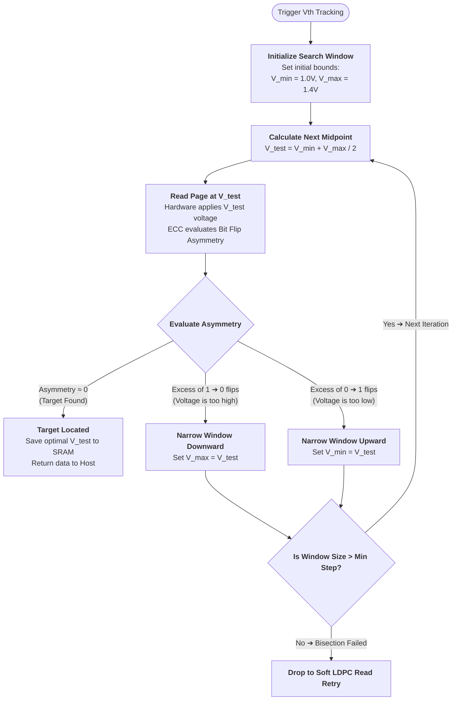

Optimal Vth is a moving target with complex dynamics (depends on temperature, charge leakage, read disturb, manufacturing variations, P/E cycles), and the drift is not a simple additive offset

----

When FTL fetches raw bits from the NAND flash memory is has **direct visibility into RBER**: the ECC engine counts exactly how many bits in a given code word have been corrupted. The FTL requires RBER information during *every* read operation. If the RBER for a specific block exceeds a safe threshold (even though the data is still 100% correctable by ECC), the FTL immediately triggers protective procedures:

  - **Read Scrubbing**: It copies the data to a new, safe location before the errors become uncorrectable.
  - **Wear Leveling**: It marks the block as potentially worn out and updates the mapping tables.
  - **Read Retry** (our "20x computationally expensive algorithm"): A mechanism, often involving high-latency Soft-Decision† LDPC† decoding, to adaptively find the optimal threshold voltage (Vth) when data retention errors rise. A high Raw Bit Error Rate (RBER) exceeding standard ECC capabilities is the primary trigger for this algorithm. This algorithm is also often triggered when we cold boot (due to Cross-Temperature Effect, Volatile Table Loss, or FTL Metadata Boot Strapping).

But for everyday read operations, these are last resort measures.

Before the firmware triggers the heavy data-rescue modes, it uses a fast, hardware-assisted mathematical method called **$V_{th}$ Tracking** or **Binary Bisection**. When a default read returns an elevated RBER, the controller leverages a hardware feature inside the ECC engine: **Bit Flip Asymmetry**. The ECC engine (like LDPC) does not just count errors, but also detects the direction of the errors:
  - $\(1\rightarrow0\)$ flips: Means the cell voltage dropped (the distribution shifted left).
  - $\(0\rightarrow1\)$ flips: Means the cell voltage increased (the distribution shifted right).

Using this directional feedback, the firmware runs a mathematical binary bisection.



# Finding optimal `Vth`, `Vmin`, `Vmax` inputs for bisect algorithm

The naive approach would be to use last known good values. To account for slow drift factors (e.g. P/E cycles) we can deploy classical statistical tools like Exponential Weighted Moving Average, but this is lagging indicator by nature therefore won't be robust when dealing with sudden shifts (e.g. read disturb, or, sudden temperature changes from cold boot running in hot server rack). However, we can improve further by using a more sophisticated approach:

During the development of a new 3D NAND flash drive, trough testing and benchmarking, we can train an Artificial Neural Networks (ANNs) to model how the physical architecture behaves based on inputs such as Program/Erase cycles (wear level), retention time (how long the data has sat unpowered), temperature variations, physical location (the exact word-line layer or column position in the 3D stack, as tapering angles change cell sizes). The neural network maps out an complex, multi-dimensional prediction of exactly how the \(V_{th}\) distributions will shift under those combined stress factors.

Instead of deploying the raw, resource-heavy neural network into the SSD's micro-controller, we can distill the neural network’s findings into lightweight mathematical formulas or polynomial regression models (decision trees?). The FTL firmware uses these ML-generated coefficients to proactively adjust the initial search bounds and starting midpoints.

Additionally,

> [!NOTE]
> and I'd like to shamelessly point out that I came up with this idea without reading it first ^^ [proof: init commit README.md LoC:88](https://github.com/smallstepman/x/commit/03a61e760c42d4e180fe3ebc6a739a63dfa565d8#diff-b335630551682c19a781afebcf4d07bf978fb1f8ac04c6bf87428ed5106870f5R88)

When the SSD is idle (not actively reading or writing for the host), the FTL controller does have the computational headroom to run more advanced ML algorithms. Many modern enterprise and high-end consumer SSDs execute Active Learning or Reinforcement Learning loops in the background. The FTL will intentionally sample degrading blocks during idle time, track how the $V_{th}$ behaves, and adjust its internal prediction tables dynamically. This ensures that the drive learns user's specific usage patterns.

# Data acquisition

### 1. The Development Phase (Silicon Lab Characterization: offline data)

We can use automated NAND Characterization Testers connected to raw NAND wafers and packaged chips. These chips are placed inside climate-controlled thermal chambers and subject the NAND to extreme conditions: writing and erasing blocks thousands of times (P/E cycle acceleration), baking the chips at high temperatures to simulate months of data leakage in hours (Accelerated Retention Loss), and reading the same cells billions of times (Read Disturb simulation). Tester sweeps voltages in tiny increments (e.g., 1mV steps) across the entire voltage range to map out the exact shape of the $V_{th}$ distribution curves. This creates a lot of raw data showing exactly how cell distributions deform under every permutation of age, temperature, and wear. This dataset is used to train the Deep Neural Networks on the manufacturer’s server farms.

### 2. The Manufacturing Phase (Accounting for Variations: offline data)

No two silicon wafers are identical. Due to microscopic variations in chemical vapor deposition, etching depth, and lithography, NAND cells in the center of a wafer might behave differently than cells on the outer edge.

During the IC Sorting† and Outgoing Quality Control (OQC) steps at the factory, every single manufactured NAND die undergoes a series of hardware tests. The tester measures the baseline resistance, cell capacitance, and native, out-of-the-box RBER of different sectors of the die. In 3D NAND, holes are etched through hundreds of layers. The geometry of these holes tapers slightly at the bottom. The manufacturing tests acquire data on how much the top layers differ from the bottom layers in performance.

Instead of running a heavy neural network here, the factory uses the acquired variation data to calculate individual Calibration Matrices (Fuses). These unique calibration coefficients are permanently burned into a special, non-volatile zone of that specific NAND die (often called "OTP" or One-Time Programmable memory). When the SSD controller boots up, its firmware reads these fuses to customize its baseline $V_{th}$ tables for the exact silicon variations of that specific drive.

### 3. The Daily Operations Phase (online data)

Once the SSD is running in a live system, the FTL acquires data dynamically to maintain an up-to-date map of the drive’s health. Data is captured by hardware performance counters baked directly into the SSD's ASIC and the ECC engine.

- For every single block or zone, the FTL updates registers tracking the exact number of P/E cycles, the time elapsed since the last write (timestamp tracking), and the number of times a block has been read since its last erase (Read Disturb Counter).
- The drive's internal On-Die Temperature Sensors continuously report real-time operating temperatures.
- Every time the Level 2 "Bisection Algorithm" runs, the FTL logs the final voltage offset that was required to fix the data. It also records the precise ratio of 1 → 0 vs 0 → 1 bit flips.
- The newly discovered $V_{th}$ offset from a successful bisection is stored in the drive's volatile SRAM/DRAM lookup tables for use on subsequent reads. 
- When the Host OS goes idle, the FTL's reviews accumulated data and runs the lightweight regression formulas against the real-time data (Temp + Age + P/E + Bit Flip history).

# Trade-offs between accuracy, memory usage, and latency

```
                [ ACCURACY ]
  (Low RBER, fewer expensive invocations)
                    /\
                   /  \
                  /    \
                 /      \
                /        \
               /          \
              /            \
             /              \
            /                \
           /                  \
          /                    \
         /                      \
        /                        \
       /                          \
      /____________________________\
[ MEMORY ]                   [ LATENCY ]
(SRAM/DRAM dies for        (Retry count, CPU time
tracking charts -           for Vth computation) 
production cost increases)

```

Improve one vertex only by sacrificing one or both others. The engineering challenge is finding the Pareto-optimal surface for specific NAND characteristics and target SSD class.

The single biggest lever is **how good your initial Vth guess is**. The better the guess, the fewer retries, the fewer expensive invocations. But getting a good guess requires memory (to store fine-grained state) or compute (to run a model per read) or both.

### Knobs 

1. bisection depth (retry budget): how many retries do we allow before giving up and invoking the "read retry" algorithm? more retries = more accurate Vth = fewer expensive invocations. But latency is user-visible. An SSD read QoS target is typically 1–2 ms for 99.99th percentile. A NAND read is ~50–100 µs. The 20× algorithm is ~ 1–2 ms. Two retries cost ~ 200 µs and still keep you under the QoS target. Four retries at ~ 400 µs plus the 20× algorithm at 1–2 ms can breach it.
    >  | Retry budget | Worst-case latency<br>(extra reads) | Accuracy of found With<br>(range after N failures) | Memory pressure |
    >  | :--- | :--- | :--- | :--- |
    >  | 0 (escalate immediately) | 0 µs | N/A — expensive algorithm runs | None |
    >  | 1 | +50–100 µs | Δ/2 (still wide) | High — you need a good initial guess |
    >  | 2 | +100–200 µs | Δ/4 (good enough for most) | Moderate |
    >  | 3 | +150–300 µs | Δ/8 (near-optimal for almost all) | Low — even coarse tracking is sufficient |
    >  | 4+ | +200+ µs | Approaching exhaustive search | Very low — you can start blind |
1. tracking granularity: how many distinct Vth offsets should we store? Go from per-die, to per-block, to per-wordline group, to finally per-page. Cost is negligible
 for DRAM-based controllers, meaningful for SRAM-only embedded controllers.
1. † histogram resolution: HD (3–4 bins, no extra reads, latency 0 µs), 1 SB (7–10 bins, latency 0 µs if soft-decode was needed anyway), 2 SB (11–16 bins, latency 0 µs if already in soft-decode path) 
1. model complexity: what formula turns (P/E cycles, retention time, temperature, histogram) into (predicted Vth, search window)?
    - The compute-latency trade: anything that runs in the read path (per-read) must complete in microseconds — the NAND read itself is ~50–100 µs, so we have maybe 5–10 µs for prediction. A polynomial with 5 coefficients and integer arithmetic fits easily. A 42-weight NN with sigmoid activations might require a hardware accelerator or software approximation. An EWMA update is essentially free (one multiply-add per offset on write-back, not on the read critical path).
    - The accuracy-memory trade: more model parameters = better prediction = fewer retries and fewer expensive invocations. But SRAM is scarce on embedded controllers (tens of KBs typically). DRAM-based enterprise controllers can afford more. NN with 42 weights reduces BER enough that the achieves near-optimal results even on EOL pages. The marginal gain from 42 weights to 112 weights is negligible.
1. offline training investment vs online accuracy: the distilled polynomial captures the known nonlinear aging curve, but are static (loaded in OTP). The EWMA captures the things the model didn't predict (specific thermal history, or usage pattern), and the state is tiny (a few bytes per group in SRAM). Together they let us start bisection close to optimum, needing 0–1 retries instead of 2–3.
    > | Strategy | Factory cost | Flash-specific data needed | Adapts to aging? | Runtime memory |
    > | :--- | :--- | :--- | :--- | :--- |
    > | No model (blind bisection) | None | None | N/A (no prediction) | 0 |
    > | Per-die calibration fuses (OTP trim values) | One-time per die at manufacturing | Per-die baseline measurements | No — static offsets | ~10–100 bytes OTP |
    > | Offline NN → distilled polynomial | Weeks of thermal chamber characterization | Tens of GB per chip family (SSRN §3) | No — static model | Polynomial coefficients per group |
    > | Offline NN + online EWMA residual (your "hybrid") | Same as above | Same | Yes — EWMA tracks deviations from predicted | Coefficients + EWMA state |
    > | Online background learning (your "idle-time RL") | Low | Real-world usage data self-collected | Yes | Model state + replay buffer |


# Comments 

- see `glossary.md` for the raw braindump or first commit to see the intuitive kind of thinking (some of it was valuable, some of it was primitive)
- it took me a while to understand the problem space well enough to be able to start asking the right questions to the LLM. While video lectures were helpful initially, they quickly got me lost due to all of the questions that were popping up in my head that they didn't provide answers to immediately. What really helped was starting to be able to mentally map and visualize the traces inside chip. Once that landed, I was able to understand the diagrams and connect with the content in lectures.
- I knew there must be a bisect algorithm involved, but for a few hours I couldn't figure out where was the directionality information coming from, and LLMs were overloading me with information I didn't understand. LLMs also fed me this info initially "you cannot observe the raw bit error rate (RBER) from a normal read" and that statement is technically true from a user-space perspective, but the breakthrough in understanding came when I asked to clarify if this is also true from the FTL perspective. 
- clearly, no denying, lots of the text here is LLM generated, but nothing is an effect of "one-shotting". The knowledge and understanding was built over several agent and chat sessions by asking sereval dozen of questions. No part of included markdown documents were ever modified in any shape or form by agent harness, any generated text was manually copy-pasted from the chat UI (and of course well understood and formatted (e.g. to remove all of the "rapid dramatic rigorous test"-kind of wording)). I decided this is better course of action as I will learn more as I go (including right nomenclature), as opposed to forcing my own wording, and have you watching me stumble by e.g. calling ASIC the "ARM CPU" (as I would)
  - † in the spirit of transparency, I've put `†` char next to all things I don't understand: https://github.com/search?q=repo%3Asmallstepman%2Fx%20†&type=code
  - if you are wondering - some of the commit messages are written with GitHub Copilot: today I learnt this feature is auto-enabled when using GitHub UI to edit files anddd commit  
- obviously, I'm fully aware this document represents a very-very high-level overview/broad-strokes understanding. I honestly didn't know how deep this rabbit hole goes :), this is extremely interesting subject. It also definitely brought some new worries to my life, like "will FTL be able to get uncorrupted data next time I ask my OS to load up binaries for my terminal" 🤣, but of course it will... R-right? 
