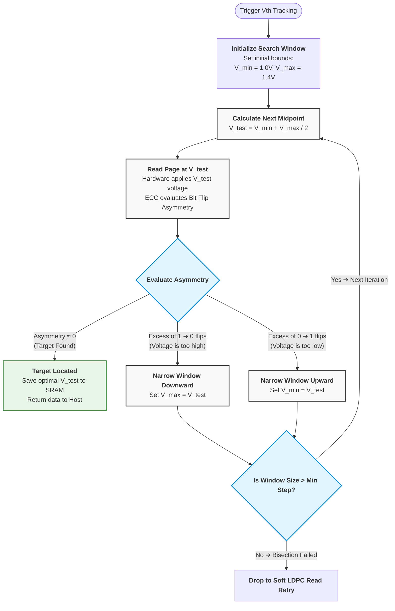

# Observations and notes from linked materials and googling and LLMing

Optimal Vth is a moving target with complex dynamics (depends on temperature, charge leakage, read disturb, manufacturing variations, P/E cycles), and the drift is not a simple additive offset

----

- When FTL fetches raw bits from the NAND flash memory is has **direct visibility into RBER**: the ECC engine counts exactly how many bits in a given code word have been corrupted. The FTL requires RBER information during *every* read operation. If the RBER for a specific block exceeds a safe threshold (even though the data is still 100% correctable by ECC), the FTL immediately triggers protective procedures:

  - **Read Scrubbing**: It copies the data to a new, safe location before the errors become uncorrectable.
  - **Wear Leveling**: It marks the block as potentially worn out and updates the mapping tables.
  - "Read Retry" (our "20x computationally expensive algorithm"): A mechanism, often involving high-latency Soft-Decision LDPC decoding, to adaptively find the optimal threshold voltage (Vth) when data retention errors rise. A high Raw Bit Error Rate (RBER) exceeding standard ECC capabilities is the primary trigger for this algorithm. This algorithm is also often triggered when we cold boot (due to Cross-Temperature Effect, Volatile Table Loss, or FTL Metadata Boot Strapping).

But for everyday read operations, these are last resort measures.

Before the firmware triggers the heavy data-rescue modes, it uses a fast, hardware-assisted mathematical method called \(V_{th}\) Tracking or Binary Bisection. When a default read returns an elevated RBER, the controller leverages a hardware feature inside the ECC engine: **Bit Flip Asymmetry**. The ECC engine (like LDPC) does not just count errors, but also detects the direction of the errors:
  - \(1 \rightarrow 0\) flips: Means the cell voltage dropped (the distribution shifted left).
  - \(0 \rightarrow 1\) flips: Means the cell voltage increased (the distribution shifted right).

Using this directional feedback, the firmware runs a mathematical binary bisection.

# Data gathering and precomputation

  - we can precompute for manufacturing variations 
- we can gather information about previous Vth value that resulted in correct read operation (with timestamp and it's PBA to later be able to determine which neighboring cells could've been affected by the Read Disturb), and other factors like temperature
- looks like reading BER > 1.1% could be a good candidate for invoking our expensive algorithm

# Problem re-statment 

At the core, the question is: 
  A) what sequence of read ops at different Vth values maximizes the probability of success before falling back to the expensive algorithm, and 
  B) if read ops fails and our predefined sequence allows for next read try, in which direction we tune Vth and how big of a step we take. 

# Finding optimal sequence / number of read attempts

To answer `A)`, we can begin by asking a question: is there a statistically-naive way of finding a **static** number of tries we can attempt to get the best performance, and while we can come up with a formula, part of that formula will depend on read error rate for previous successful data fetching operations, and that error rate isn't constant (because the drive might age, or environmental factors may change(temp)), therefore the **static** value doesn't exist, and we need to come up with a formula for finding optimal number of attempts based on collected information so far.

# 

- the expensive algorithm can run on a separate thread when the device is idle (assuming it doesnt degrade the disk), and cache the correct Vth for the block
